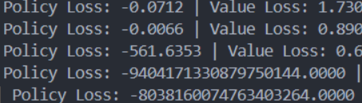

## Report part 1
## Implementation of RL model on JAX

Агент взаимодействует со средой, получая наблюдения, выбирая действия и получая награды, на основе которых происходит обучение.

### Среда и данные

- Наблюдения (observations): векторное представление состояния среды (позиция, скорость, информация о дороге и т.д.).

- Действия (actions): непрерывные управляющие действия роботакси (например, ускорение и поворот).

- Награда (reward): скалярная величина, отражающая качество поведения агента (безопасность, скорость достижения цели, комфорт).

- Эпизоды: обучение происходит на траекториях, сохранённых в памяти PPOMemory.

### Модель PPO

Используются две нейронные сети:

- Policy Network (Actor):

    - Принимает наблюдение и выдает параметры нормального распределения (среднее и логарифм стандартного отклонения) для непрерывных действий.

    - Состоит из двух скрытых слоёв с функцией активации ReLU.

- Value Network (Critic):

    - Оценивает ценность состояния (value function).

    - Имеет аналогичную архитектуру, но на выходе возвращает одно скалярное значение.

- Для обучения используется:

    - Generalized Advantage Estimation (GAE) для вычисления преимуществ (advantages).

    - Clipped PPO loss для устойчивого обновления политики.

    - Оптимизатор Adam для обновления параметров сетей.

### Оптимизация вычислений

- Для повышения эффективности и скорости вычислений были применены следующие подходы:

- Использование JAX

    - Все вычисления выполняются с использованием jax.numpy, что позволяет эффективно использовать CPU/GPU/TPU.

    - Автоматическое дифференцирование ускоряет вычисление градиентов.

    - Векторизация (vmap)

    - Применяется jax.vmap для обработки батчей наблюдений без явных циклов Python.

- Equinox (eqx)

    - Используется для удобного определения нейронных сетей и фильтрации параметров.

    - Градиенты вычисляются только для массивов, что снижает вычислительные затраты.

- Разделение обновлений policy и value

    - Политика и функция ценности обновляются отдельно, что упрощает вычисления и улучшает стабильность обучения.

- Нормализация преимуществ

    - Advantage значения нормализуются, что уменьшает дисперсию градиентов и ускоряет сходимость.


### Reflection 
Получился неоднозначный результат. Хоть и во время обучения модель и показывала очень хороший награды, однако в видео src\video\Result_ppo.mp4 мы видим что машинка не касается цели а врезается в стену. Скорее всего это из за нестабильной политики ппо. Возможно если обучение на 1-2 увеличить или уменьшить результат будет корректный.

Также была одна проблема со взрывающимся градиентом:



Множество проблем возникало с булевыми переменными в jax. Визуализация не заканчивалась при остановке.

Забавный результат в начале произошел при недолгом обучении модели, где модель просто доходила до определенного места и ждала пока ее собьет препятствие src\video\why.mp4

### Usage
Чтобы обучить новую модель 
```python src/run_training.py```
Чтобы воспользоваться чекпоинтом модели
```python src/play_training_model.py```